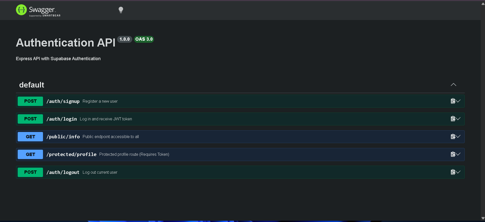

# Supabase Authentication API

A robust, fully functional authentication API built with Node.js, Express, and Supabase. This project demonstrates secure user registration, login, and JWT-based route protection.

## 🚀 Features
* **User Authentication:** Signup and login routes powered by Supabase Auth.
* **Route Protection:** Custom middleware to secure endpoints using JWT Bearer tokens.
* **Session Management:** Secure logout functionality.
* **Interactive Documentation:** Fully documented API using Swagger UI.

## 🛠️ Tech Stack
* Node.js
* Express.js
* Supabase (@supabase/supabase-js)
* Swagger UI (swagger-ui-express)

## 📚 API Endpoints

### Authentication
* `POST /auth/signup` - Register a new user with email and password.
* `POST /auth/login` - Log in and receive a JWT access token.
* `POST /auth/logout` - Invalidate the current session (Requires Token).

### Routes
* `GET /public/info` - Public endpoint accessible to anyone.
* `GET /protected/profile` - Protected endpoint returning user details (Requires Token).

## 📖 API Documentation
Interactive API documentation is available at the `/docs` endpoint.


## 💻 Installation & Setup

1. **Clone the repository:**
   ```bash
   git clone <your-repo-url>
   ```
2. **Install dependencies:**
   ```bash
   npm install
   ```
3. **Set up environment variables:**
   * Create a `.env` file in the root directory.
   * Add your Supabase credentials:
     ```env
     SUPABASE_URL=your_supabase_project_url_here
     SUPABASE_KEY=your_supabase_anon_key_here
     PORT=3000
     ```
4. **Start the server:**
   ```bash
   node server.js
   ```

## 👨‍💻 Author
**Rasba Mazhar**  
*Computer Science Undergraduate & Full Stack MERN Developer*